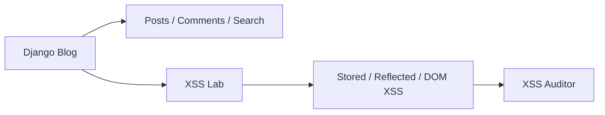
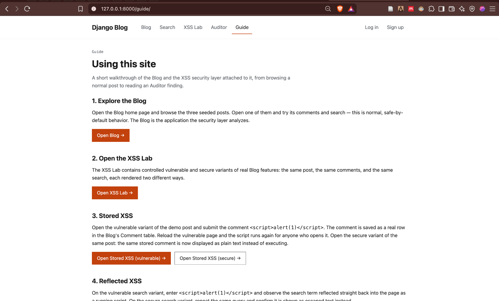
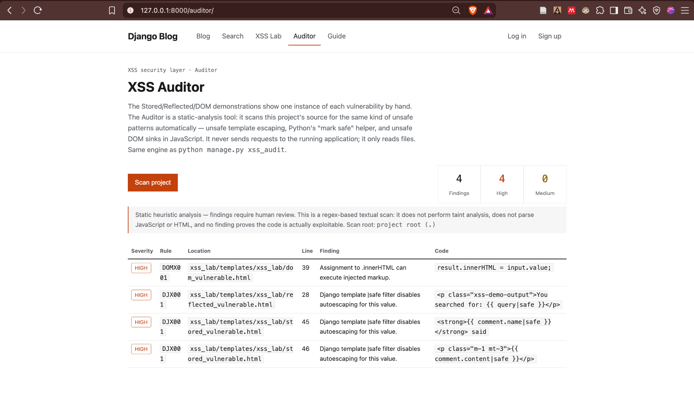

# Django XSS Security Lab & Auditor

A functional Django blog with a controlled security lab attached to it. The blog handles posts,
comments, search, authentication, and profiles like a normal application. The XSS Lab layered on
top demonstrates Stored, Reflected, and DOM-based Cross-Site Scripting against that same real
blog functionality, each vulnerable example paired with a secure counterpart, alongside a
lightweight static-analysis Auditor that scans the project's own source for the same patterns.

**Status:** Django 5.2 LTS

---

## Features

- Django blog with posts, comments, search, authentication, and user profiles
- Reproducible seeded demo content (one author, three posts) via a single management command
- Stored XSS demonstrated on real blog comments (`core.Comment`)
- Reflected XSS demonstrated on the blog's real search query handling
- DOM-based XSS demonstrated with a client-side search-preview widget
- Every vulnerability is paired with a secure equivalent rendering the same data
- XSS Auditor available both as a CLI command and a web page, sharing one scan engine
- Normal blog routes are safe by default; vulnerable behavior is isolated to explicit XSS Lab routes

---

## Architecture



The Django blog is the primary application, and its normal routes remain safe by default.
Intentionally vulnerable behavior exists only on the explicit XSS Lab routes, each rendering the
same underlying blog data as its secure counterpart so the two can be compared directly.

---

## XSS Demonstrations

### Stored XSS

real blog comment &rarr; database (`core.Comment`) &rarr; vulnerable `|safe` rendering &rarr;
secure normal Django escaping

### Reflected XSS

blog search query &rarr; vulnerable `|safe` reflection &rarr; secure escaped rendering

### DOM-based XSS

client-side input &rarr; vulnerable `innerHTML` assignment &rarr; secure `textContent` assignment

---

## XSS Auditor

The Auditor is a lightweight, heuristic static-analysis tool. It reads the project's source code
rather than dynamically attacking the running website, and it does not perform taint or
data-flow analysis. A finding does not prove exploitability; every finding requires human review.

Current rule categories:

- Django `|safe`
- ``
- Python `mark_safe()`
- `innerHTML`
- `outerHTML`
- `document.write()`
- `insertAdjacentHTML()`

Each finding reports a severity, a rule ID, a repository-relative file path, a line number, a
short explanation, and a short matching code snippet.

Run it from the command line:

```bash
python manage.py xss_audit
```

Or point it at another local source directory:

```bash
python manage.py xss_audit /path/to/project
```

The same scan is also available on the Auditor page inside the running application.

---

## Screenshots

### XSS Lab



### XSS Auditor



---

## Technology Stack

- Python
- Django 5.2 LTS
- SQLite
- HTML/CSS
- Vanilla JavaScript
- Pillow
- Django test framework

---

## Repository Structure

```
.
├── blog/            # Project settings and root URL configuration
├── core/            # Blog app: posts, comments, search
├── users/           # Authentication and profile app
├── xss_lab/         # XSS Lab: vulnerable/secure demonstrations and the Auditor
├── static/          # CSS, demo post images, and other static assets
├── templates/       # Shared and app-specific HTML templates
├── manage.py
└── requirements.txt
```

---

## Local Setup

### Prerequisites

Python 3

### 1. Clone

```bash
git clone https://github.com/sasi-1902/Analyzing-XSS-on-Django.git
cd Analyzing-XSS-on-Django
```

### 2. Create environment

```bash
python3 -m venv .venv
source .venv/bin/activate
```

On Windows, activate with:

```bash
.venv\Scripts\activate
```

### 3. Install dependencies

```bash
pip install -r requirements.txt
```

### 4. Initialize database

```bash
python manage.py migrate
```

### 5. Seed demo blog content

```bash
python manage.py seed_demo
```

This creates the reproducible demo author and three blog posts used throughout the XSS
demonstrations. It is safe to run more than once.

### 6. Run application

```bash
python manage.py runserver
```

Open:

```
http://127.0.0.1:8000/
```

---

## Using the Project

Start on the Blog, open the XSS Lab, compare each vulnerable and secure variant, then open the
Auditor to see the same patterns found in the project's source. The in-application Guide
(`/guide/`) contains the full step-by-step walkthrough.

---

## Security Scope and Limitations

- Intentionally vulnerable routes are for local educational use only
- Do not expose the vulnerable routes publicly
- The Auditor is regex/text-pattern based
- It performs no taint or data-flow analysis
- Findings do not prove exploitability
- Current rules focus on Django/Python and basic JavaScript XSS patterns

---

## Roadmap

- Additional framework-specific XSS rules
- Standalone scanner packaging
- CI integration
- Improved contextual analysis and reduced false positives

---

## Author

**Sasi Deepika Eluri**

- [GitHub](https://github.com/sasi-1902)
- [LinkedIn](https://www.linkedin.com/in/sasi-deepika-eluri/)
- Email: [esasideepika@gmail.com](mailto:esasideepika@gmail.com)
---

## License

This project is released under the MIT License, retaining its existing license and original
copyright notice. See [LICENSE](LICENSE) for the full text.
